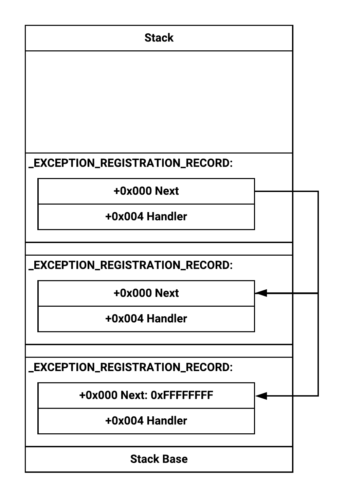

# Structure Exception Handling (SEH) Overflow

## Les exceptions

Une exception est un comportement inattendu qui arrive durant l'exécution normale d'un programme.

Il existe 2 types d'exception :

* Materiel : Les exceptions matérielles sont initiées par le `CPU`
  * e.g. : Le `CPU` essaye de faire référence à une adresse mémoire invalide
* Logiciel : Les exceptions matérielles sont initiées par les applications
  * e.g. :  Un développeur veut lever une exception dans le code pour signaler qu'une fonction ne s'est pas exécutée correctement via un bloc `try {} except {}`

La plupart des langages implémente des fonctionnalités de `try` et `catch` bien que les mots clés puissent varier.

À la suite de la compilation, `try {} except {}` va utiliser le mécanisme `Structure Exception Handling (SEH)` implémenté par Windows pour gérer les événements inattendus.

## Le mécanisme SEH

Le mécanisme `SEH` donne la possibilité aux développeurs de prendre action quand un événement inattendu se réalise durant le flot d'exécution d'un *thread*.

Quand un thread est en défaut le système d'exploitation appelle un ensemble de fonctions prédéfinies nommées *exception handlers*.

Ces fonctions vont fournir des données et tenter de corriger l'exception.Les *exception handlers* sont créées durant la compilation.

À chaque fois qu'un bloc `try` est rencontrée durant l'exécution d'une fonction dans un *thread*, un pointeur vers le *handler* correspondant est stocké sur la stack dans la structure `_EXCEPTION_REGISTRATION_RECORD`. Comme il peut y avoir plusieurs blocs `try` exécutés dans une fonction ces structures sont liées par une liste chainée.



Quand une exception est levée, l'OS inspecte la structure `Thread Environmental Block` (`TEB`) du thread impliqué et retrouve le pointeur (`ExceptionList`) vers la liste chainée `_EXCEPTION_REGISTRATION_RECORD` via le registre `FS` du CPU.

Apres avoir retrouve le `ExceptionList` l'OS va appeller chaque *exception handler* jusqu'a ce qu'une d'entre elle puisse gerer l'evenement.

Si aucune des fonctions définies par l'utilisateur ne peut gérer l'exception, l'OS va appeler le *default exception handler* qui est le dernier noeud de la liste chainée.

### Structures

Structure `TEB` :

```c
0:010> dt nt!_TEB
ntdll!_TEB
   +0x000 NtTib            : _NT_TIB
   +0x01c EnvironmentPointer : Ptr32 Void
   +0x020 ClientId         : _CLIENT_ID
   +0x028 ActiveRpcHandle  : Ptr32 Void
   +0x02c ThreadLocalStoragePointer : Ptr32 Void
   +0x030 ProcessEnvironmentBlock : Ptr32 _PEB
   +0x034 LastErrorValue   : Uint4B
   +0x038 CountOfOwnedCriticalSections : Uint4B
   +0x03c CsrClientThread  : Ptr32 Void
   +0x040 Win32ThreadInfo  : Ptr32 Void
```

On voit que le premier élément de la structure `TEB` est lui-même une structure de type `_NT_TIB` :

```c
0:010> dt _NT_TIB
ntdll!_NT_TIB
   +0x000 ExceptionList    : Ptr32 _EXCEPTION_REGISTRATION_RECORD
   +0x004 StackBase        : Ptr32 Void
   +0x008 StackLimit       : Ptr32 Void
   +0x00c SubSystemTib     : Ptr32 Void
   +0x010 FiberData        : Ptr32 Void
   +0x010 Version          : Uint4B
   +0x014 ArbitraryUserPointer : Ptr32 Void
   +0x018 Self             : Ptr32 _NT_TIB
```

Le premier élément de la structure nommé `ExceptionList` est un pointeur sur la structure `_EXCEPTION_REGISTRATION_RECORD` :

```c
0:010> dt _EXCEPTION_REGISTRATION_RECORD
ntdll!_EXCEPTION_REGISTRATION_RECORD
   +0x000 Next             : Ptr32 _EXCEPTION_REGISTRATION_RECORD
   +0x004 Handler          : Ptr32     _EXCEPTION_DISPOSITION
```

* `Next` fais le lien pour la liste chainée et est un pointeur sur la structure `_EXCEPTION_REGISTRATION_RECORD`
* `Handler` est un pointeur vers la fonction *exception callback* nommé `_except_hamdler` qui renvoie une structure `_EXCEPTION_DISPOSITION`

Structure `_EXCEPTION_DISPOSITION` :

```c
typedef EXCEPTION_DISPOSITION _except_handler (*PEXCEPTION_ROUTINE) (  
    IN PEXCEPTION_RECORD ExceptionRecord,  
    // Pointe sur la structure `_EXCEPTION_REGISTRATION_RECORD`
    IN VOID EstablisherFrame,  
    // Pointe sur la structure `CONTEXT`
    IN OUT PCONTEXT ContextRecord,  
    IN OUT PDISPATCHER_CONTEXT DispatcherContext  
);
```

La structure `CONTEXT` contiens les données de certains registres du CPU lorsque l'exception est levée. Contiens plusieurs éléments, dont le pointeur `EIP`.

Les informations de cette structure vont être utilisées pour restaurer le flot d'exécution après la gestion de l'exception.

Si le *exception handler* invoqué par l'OS n'est pas valide pour gérer l'exception il va renvoyer `ExceptionContinueSearch`. Va indiquer à l'OS de se déplacer à l'élément suivant de la liste chainée `_EXCEPTION_REGISTRATION_RECORD`.

Si le *exception handler* est à même de *handle* l'exception il va renvoyer `ExceptionContinueExecution`. Va indiquer à l'OS de relancer l'exécution.
